# Online E-Voting System for Cameroon's Presidential Election

🗳️ Online Voting System
📌 Project Overview

## ⚙️ How the System Works

The Online Voting System is designed to digitize and simplify the election process while ensuring fairness, security, and efficiency. It operates through two main roles: **Admin** and **Voter**.

---

### 🧑‍💼 Admin Workflow

1. **Login to Admin Panel**
   - The administrator logs into a secure dashboard.

2. **Set Up Election**
   - Create positions (e.g., President, Secretary)
   - Add candidates for each position

3. **Manage Voters**
   - Register voters manually or manage voter records
   - Assign login credentials to voters

4. **Control Voting Process**
   - Open or close the voting session
   - Monitor participation in real time

5. **View Results**
   - Votes are automatically counted
   - Results are displayed instantly after voting ends

---

### 🧑‍🤝‍🧑 Voter Workflow

1. **Registration / Login**
   - Voters log in using their credentials

2. **Access Ballot**
   - The system displays available positions and candidates

3. **Cast Vote**
   - Voters select their preferred candidates
   - Each voter can only vote once (duplicate voting is prevented)

4. **Vote Confirmation**
   - A confirmation prompt ensures the voter verifies their choices

5. **Submission**
   - Votes are securely stored in the database

---

### 🔐 Security & Integrity

- Each voter is allowed **only one vote**
- Session-based authentication prevents unauthorized access
- Input validation protects against invalid data
- Votes are stored securely in the database
- Admin controls ensure election integrity
- Passwords are hashed and stored securely in the database using the bcrypt hashing algorithm.
- Each voter's unique ID is automatically generated using a PHP script. 
- The system creates a 16-character alphanumeric identifier (a combination of letters and numbers) to ensure uniqueness and    enhance security.
---

### ⚡ System Behavior

- The system processes votes in real-time
- Results are automatically updated
- No manual counting is required
- Ensures transparency and reduces human error

---

### 🧠 Summary

This system provides a **simple, fast, and reliable digital voting platform** that can be used for:
- Presidential Elections
- School elections
- Organizational voting
- Small-scale governmental simulations

It demonstrates core concepts of:
- Authentication systems
- Database management
- Real-time data processing
- Role-based access control

🚀 Features
User registration and login system
Secure authentication
Vote casting (one vote per user)
Real-time vote counting
Admin dashboard for managing elections
Candidate management
Results display after voting ends
Email notifications (via PHPMailer)
🛠️ Tech Stack
Frontend: HTML, CSS, JavaScript
Backend: PHP
Database: MySQL
Server: XAMPP / Apache
Email Service: PHPMailer

📂 Project Structure
Online-Voting-System/
│
├── admin/              # Admin panel
├── voters/             # Voter interface
├── database/           # SQL file
├── includes/           # Config files
├── PHPMailer/          # Email library
├── tcpdf/              # PDF generation library
└── index.php           # Entry point

⚙️ Installation Setup
1. Clone the repository
git clone https://github.com/TechBro-237/Online-Voting-System.git
2. Move to XAMPP directory
Place the project inside:
C:\xampp\htdocs\

4. Start server
Start Apache and MySQL in XAMPP

6. Import database
Open phpMyAdmin
Create a database (e.g. voting_system)
Import:
DATABASE/voting_system.sql

8. Run project
Open browser:
http://localhost/Online-Voting-System/

🔐 Security Features
Prevents double voting
Session-based authentication
Input validation
Secure database queries

📸 Screenshots

## 📸 System Preview

### Admin Login Page
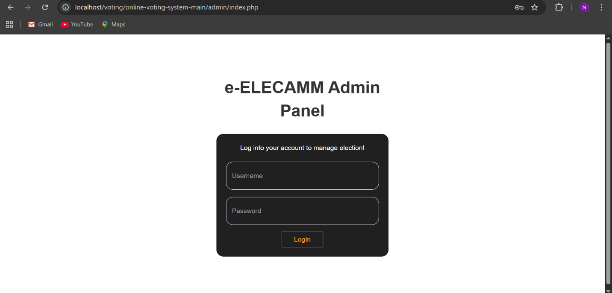

### Manage Ballots
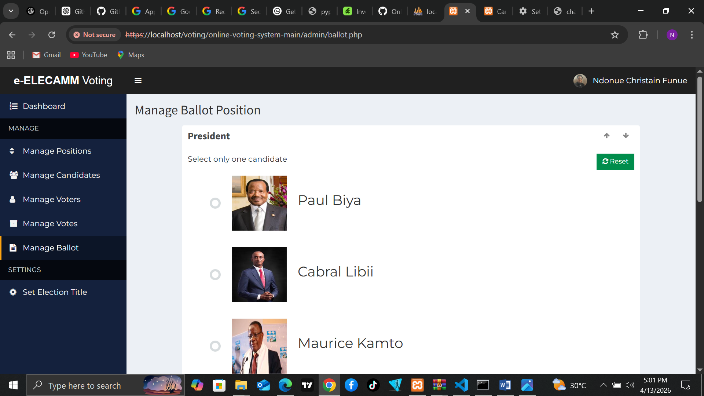

### Manage Candidates
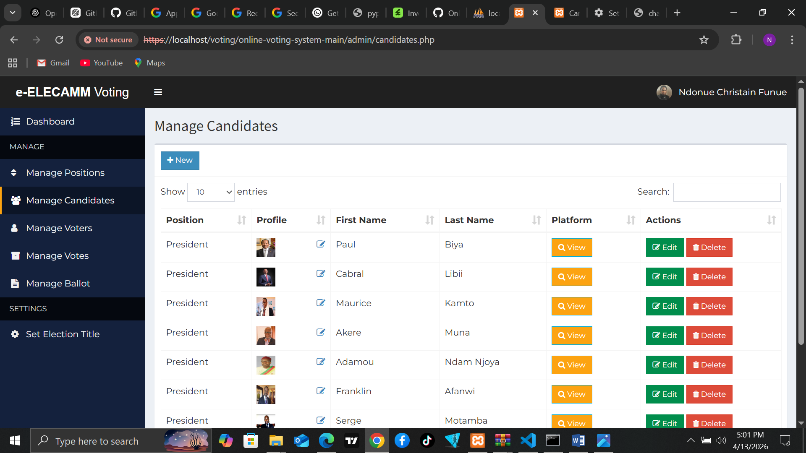

### Manage Positions
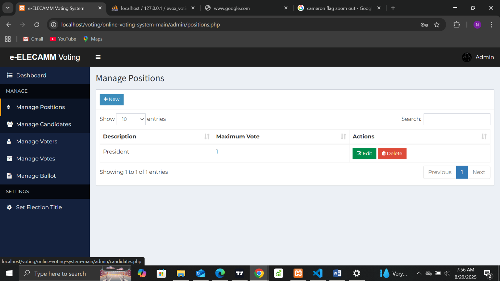

### Manage Voters
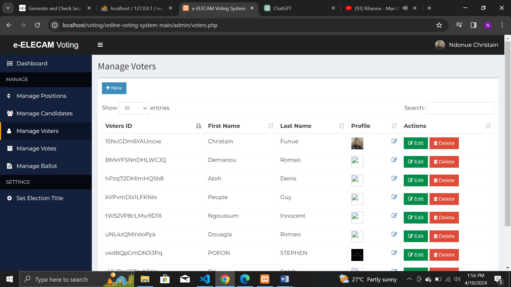

### Manage Votes
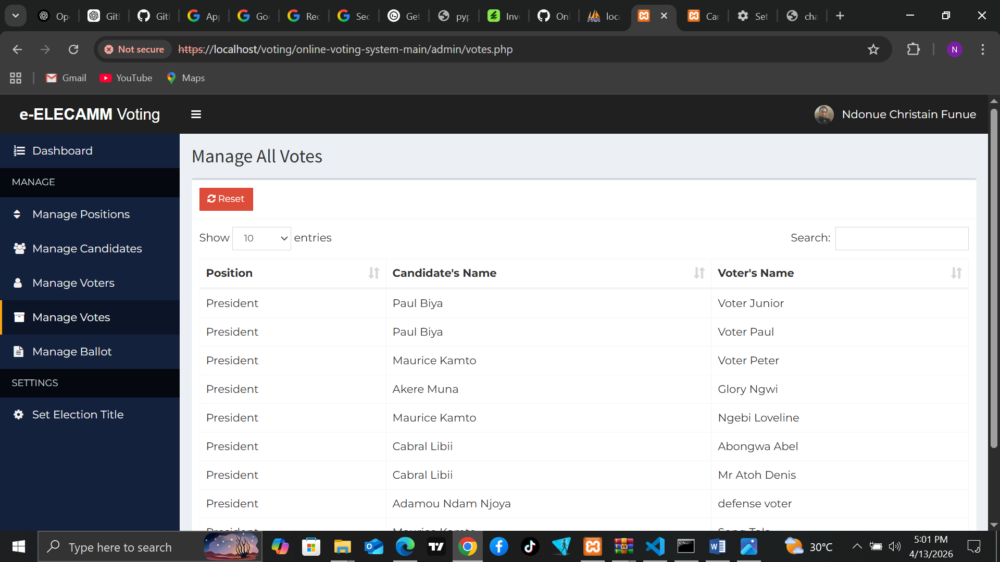

### Ballot Counting Panel
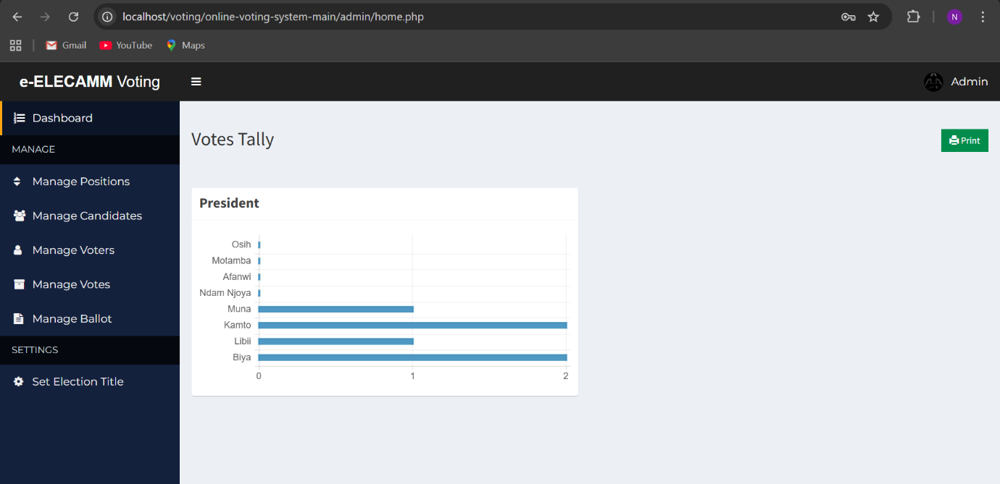

### Database Overview
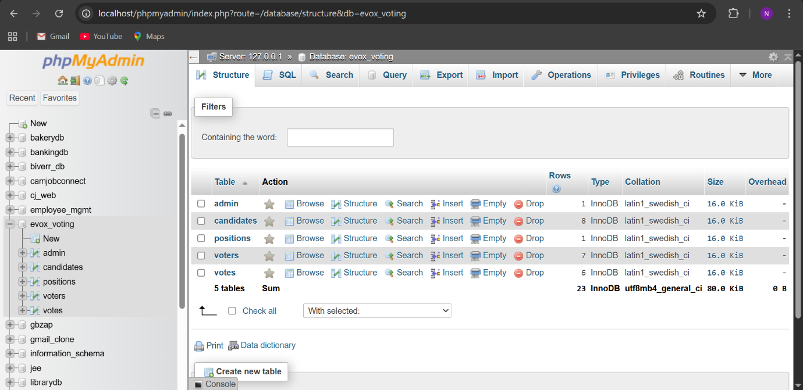

### Election Setup
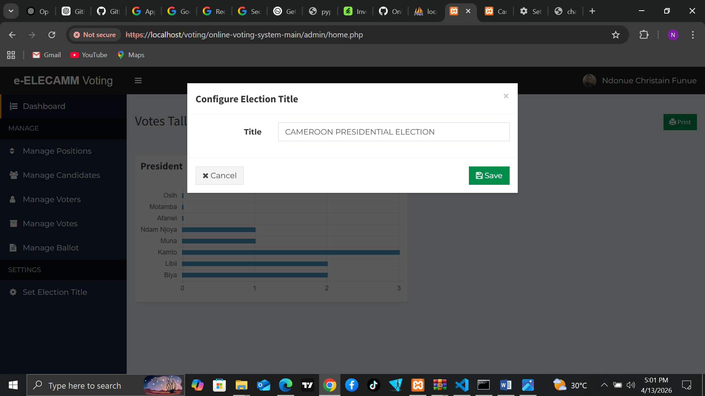

### Voter Registration Success
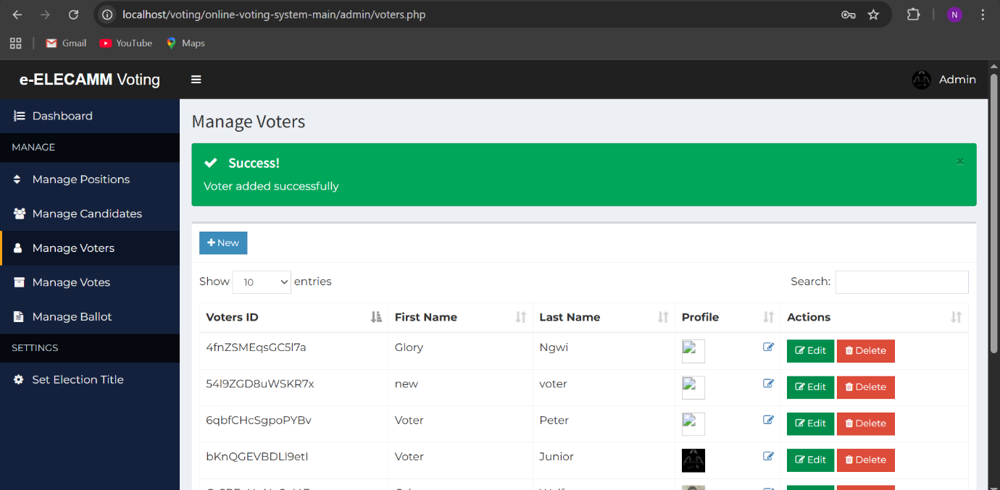

### Vote Confirmation Dialog
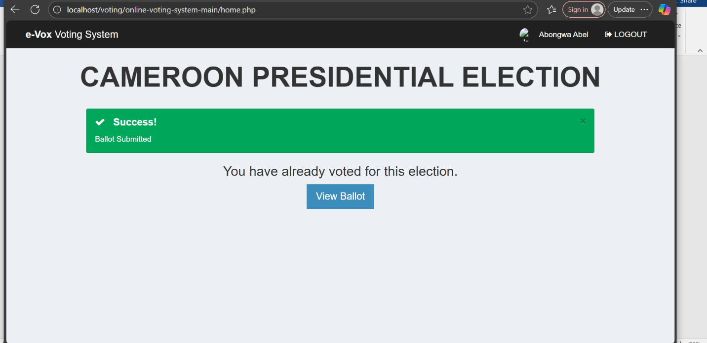

### Voter Login Page

### Votes Tally
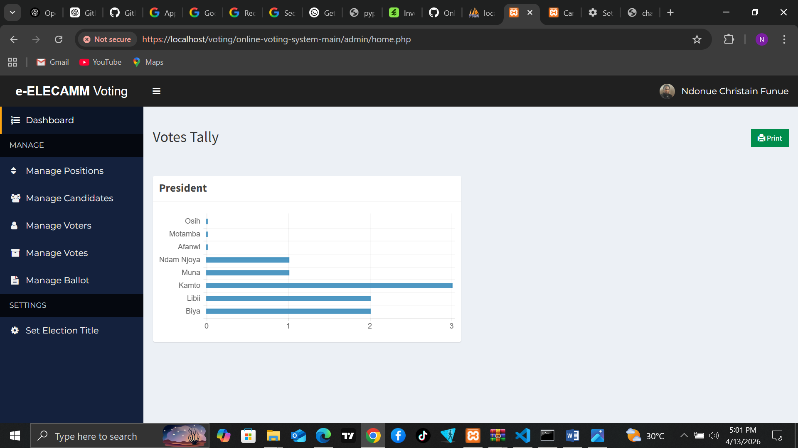

### Voting Panel
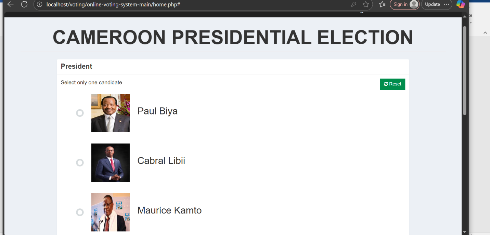

👨‍💻 Author

Ndonue Christain Funue (TechBro-237)
GitHub: https://github.com/TechBro-237

📌 Note

This project here is only demonstration purposes. It can be extended into a full-scale secure e-voting platform.

📄 License

This project is currently unlicensed. All rights reserved by the author.
No changes or updates or reuse of this code is permitted.
Thanks!!!
